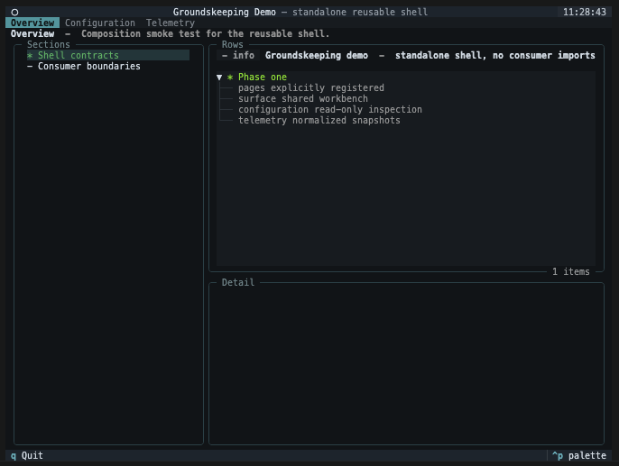

# Using a Groundskeeping app

Groundskeeping is the shared interface used by applications such as Groundworkers. The application decides which setup areas, checks, and configuration changes are available, so the names on your screen may differ from the examples here. The interaction pattern stays the same.

## Find your way around

Most Groundskeeping apps have page tabs across the top and three working areas below them.



| Area | What to use it for |
|---|---|
| Page tabs | Move between broad areas such as Setup, Configuration, or Telemetry. |
| Left navigation | Choose a section or an item within the current page. |
| Results | Inspect the checks, resources, or settings in that section. |
| Detail | Read more about the highlighted result without leaving the page. |
| Action buttons | Refresh information, test a service, or start a guided change. |

The purpose line under a page title explains what that page is for. If a page reports that it could not be rendered, copy the visible error context for the application support team; one failed page should not close the whole app.

## Read status at a glance

Groundskeeping uses a small status vocabulary across pages. An application may add more specific wording in the message or detail panel.

| Status | What it usually means | What to do |
|---|---|---|
| OK | The check passed or the resource is ready. | No action is normally needed. |
| Warning | The item can be used, but something deserves attention. | Read the detail before continuing. |
| Error | The check failed or the item is not usable. | Follow the displayed guidance or contact the application owner. |
| Running | Work is still in progress. | Wait for the result; cancel only if the application offers it safely. |
| Info or Idle | The item is informational, has not run, or has nothing to show yet. | Select it for detail or run the relevant check. |

## Check an environment before changing it

A setup page should help you answer: “Is this environment ready for the work I am about to run?” Start with read-only actions such as **Refresh status** or **Test connection**. These checks are useful evidence: a setting can look correct while the service it points to is unavailable.

When a table allows selection, disabled rows cannot be chosen. Some tables offer an **All** row; choosing a specific row turns off **All**, and choosing **All** clears the specific choices.

## Make a guided configuration change

Applications can expose configuration changes as wizards. A typical change follows this path:

```text
Choose an operation → enter settings → review the safe plan → apply → refresh affected pages
```

The available steps may change after an earlier choice. For example, choosing SQLite can skip server connection fields that are required for PostgreSQL. If you go Back and change that choice, answers from steps that no longer apply are discarded.

Before applying, read all three parts of the review:

| Review area | What it tells you |
|---|---|
| Changes | Which fields will be added, changed, or removed. Secret values are never shown. |
| Effects | Which other configuration entries refer to, or are affected by, this target. |
| Warnings and issues | Whether the change needs attention or is blocked. Warnings allow apply; errors do not. |

Secret fields are cleared from the screen after you submit a step. Going Back does not restore the secret, and the review only reports that it changed. This is intentional. If you return to a required secret step and move forward again, re-enter the value; that submission replaces the value staged by the provider.

## Understand the result

| Result | Meaning | Next step |
|---|---|---|
| Applied | The provider saved the prepared change. | Refresh any pages named in the result and run the relevant check. |
| Conflicted | The configuration changed after your review. Groundskeeping did not overwrite it. | Reload the latest configuration and prepare the change again. |
| Rejected | The provider understood the request but refused it because of application policy or current state. | Read the reason, adjust the request if appropriate, or contact the application owner. |
| Failed | The provider could not complete the operation. | Read the safe error detail and retry only after addressing the cause. |
| Cancelled | You left the wizard without applying. | No apply attempt was made. Follow any warning if the provider could not confirm session cleanup. |

An apply attempt cannot be repeated with the same review token, regardless of its result. This prevents an old plan from being applied after the environment has changed.

Every apply result closes the wizard. If the change conflicts, is rejected, or fails, the application can refresh the affected page before you begin a new attempt. Your previous wizard session is not reused.

## Know which configuration is open

The configuration browser may show the path from which the stack was loaded. Use it to confirm that you are inspecting the intended environment. The path is descriptive: its presence does not mean the current app can write to that file.

Configuration sections remain visible when empty, so **not configured** is different from a section that was not inspected. Reference states are also explicit:

| Reference state | Meaning |
|---|---|
| Resolved | The named destination exists and has the required type. |
| Missing | No configuration entry has that name. |
| Wrong kind | The name exists, but it cannot be used by this field. |
| Package schema unavailable | A tool is visible, but the application could not load enough type information to validate all of its fields or references. |

If you need exact recovery steps, file locations, credential sources, or restart instructions, use the documentation for the application you are running. Groundskeeping provides the shared interaction model; the application owns those environment-specific details.
